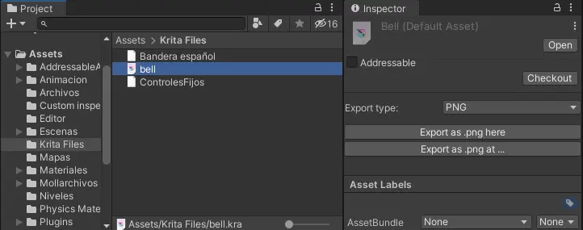

# Krita file exporter in unity



## Description
With this custom inspector you can easily export your .kra files into supporter krita formats by selecting the krita file in Unity and the default asset inspector will by replaced by the [KritaEditor.cs](./KritaEditor.cs) custom inspector.

## Setup
- Place the [KritaEditor.cs](./KritaEditor.cs) inside an Editor folder inside your project.

- Before start you need to set you krita installation path in a variable named "KRITA_INSTALLATION_PATH" inside the [KritaEditor.cs](./KritaEditor.cs).
```cs
// private const string KRITA_INSTALLATION_PATH_EXAMPLE = "C:\\Program Files\\Krita (x64)\bin\\krita.exe";

private const string KRITA_INSTALLATION_PATH = ""; 
```
